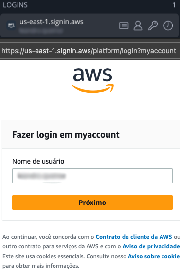

# AWS Chrome Extension

## Features

- Display the account name in the top menu of the AWS console.
  
- Updates the state of the SSO URL to include the AWS organization name as the query string
  
